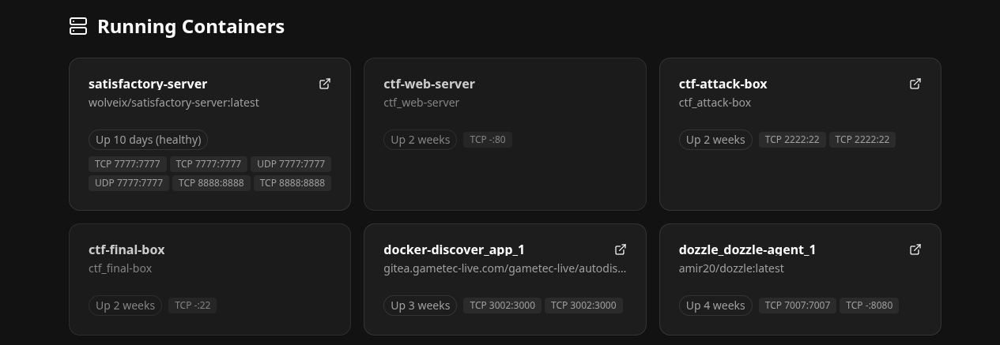

# Docker Autodiscover Home / Dashboard

Stupid simple dashboard that does docker autodiscovery and lists all containers.

This uses the docker socket to list all running contaienrs, get the first port and provide easy redirects to it without requiring any extra setup.

## Get started

Simply clone this repository and run `docker compose up -d` to get started.

Whenever you expose the docker socket it is recommended to go and use a docker socket proxy like [this 11 notes one.](https://github.com/11notes/docker-socket-proxy)

Remember to set the `HOST_URL` in the env var correctly or else the redirects wont work properly.

